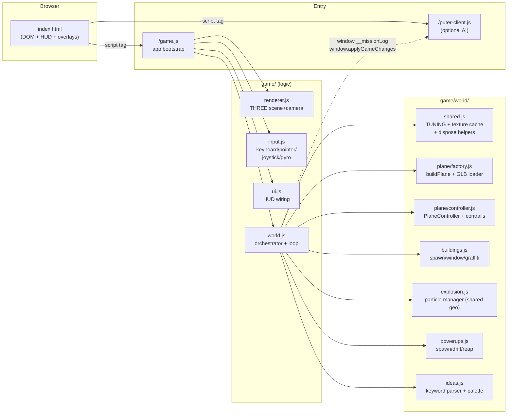
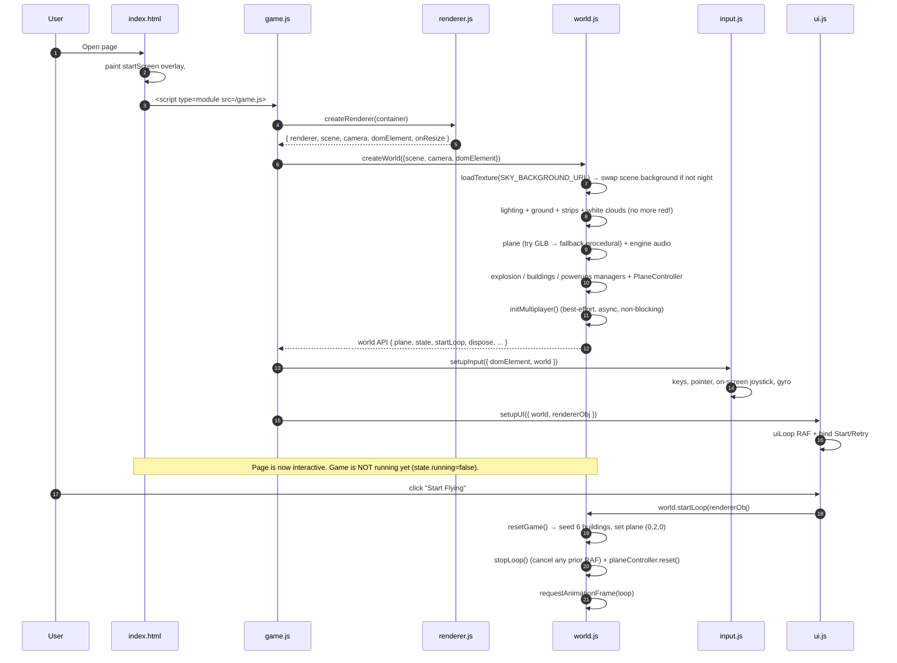
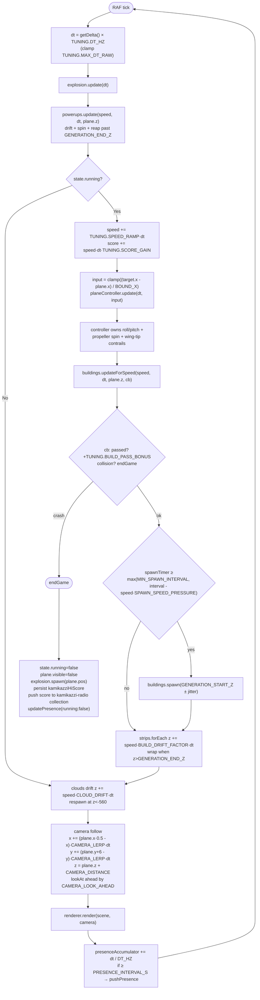
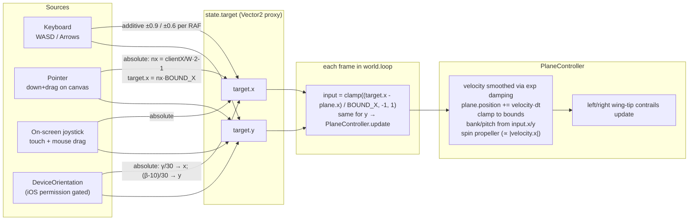
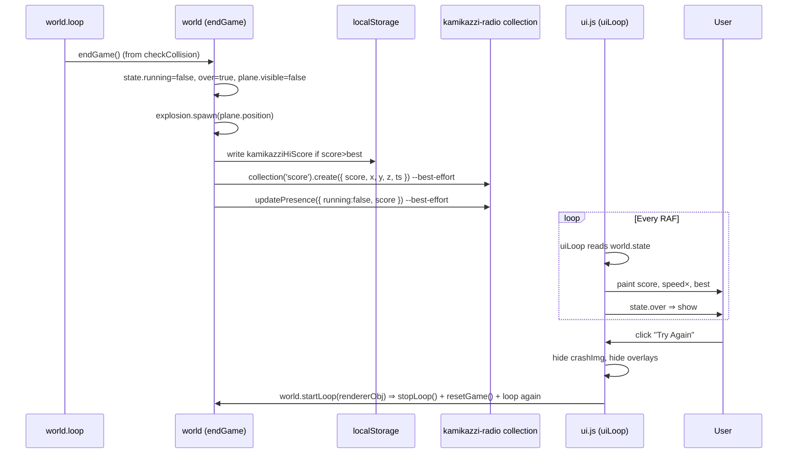
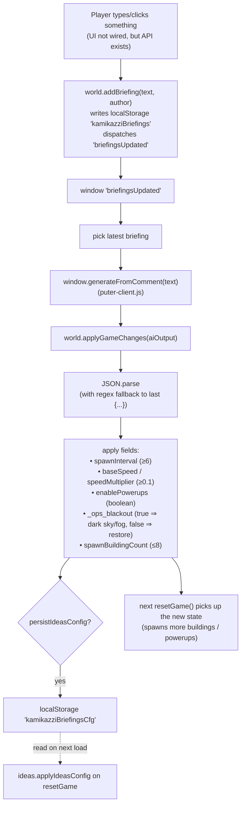
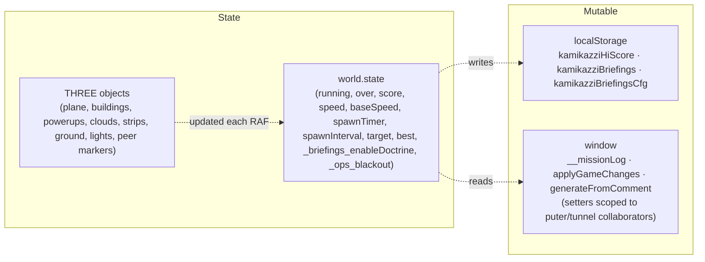

# Kamikazzi 3D — Visual Logic-Flow Map

> A diagram-first walkthrough of how the game boots, runs, and reacts.
> Diagrams use Mermaid; render in any Markdown viewer that supports them.

## 1. Module Dependence (one-glance overview)



**Stand-alone files (not used by the game logic):**
- `puter-client.js` — optional AI/Puter integration.
- All assets live under `/assets/...` and are loaded via root-relative URLs.

---

## 2. Bootstrap (page-load → first frame)



---

## 3. Main Game Loop (every frame)



> After `endGame()` the loop keeps running so clouds, camera, and the post-game UI loop continue.

---

## 4. Input → Plane Translation



**Conflict note.** Keyboard modifies `target.x` *additively*; pointer / joystick / gyro write it *absolutely*. Today, the absolute writer wins on hybrid input setups.

---

## 5. End-of-Run / Crash Flow



---

## 6. Ideas / "Briefings" Pipeline (best-effort)



Two parallel config systems read "briefings": the deterministic keyword parser (night / powerup / shield / speed boost) AND the AI-driven JSON object. Both flip `_briefings_enableDoctrine`.

---

## 7. Multiplayer Presence (best-effort)

```mermaid
sequenceDiagram
  participant W as world (initMultiplayer)
  participant S as WebsimSocket
  participant Net as Server

  W->>S: new WebsimSocket()
  W->>S: await room.initialize()
  W->>Net: updatePresence({x, y, z, score, running})
  W->>S: subscribePresence(map)

  loop Every strike
    Net-->>S: presence map { clientId ⇒ presence }
    S-->>W: callback fires
    W->>W: for each peer: lerp toward presence; scale ∝ score; remove gone peers
  end

  loop Each game RAF
    W->>Net: presenceAccumulator += dt/DT_HZ<br/>if ≥ TUNING.PRESENCE_INTERVAL_S → pushPresence
  end

  Note over W: presence appears as a single capsule mesh; not a real plane render.
```

---

## 8. Lifecycle Cheat-Sheet

| Event                          | Side effects                             |
|--------------------------------|------------------------------------------|
| Page load                      | Renderer + world + input + UI bound. RAF uiLoop starts. **No game yet.** |
| Click "Start Flying"           | `world.stopLoop()` (cancel prior) + `planeController.reset()` + `resetGame()` + first `loop()` RAF; engine sound tries to play under the user gesture |
| Per-frame (running)            | score↑, speed↑, PlaneController steers, buildings drift + spawn, strips scroll, clouds drift, camera follows, periodic presence |
| Collision                      | `endGame()` ⇒ explosion, hidden plane, persist `kamikazziHiScore`, push score, presence update; loop continues |
| "Try Again"                    | overlays hidden, **same** `startLoop` re-runs (prior RAF cancelled) |
| Page unload                    | `world.dispose()` walks scene and disposes unique GPU buffers while leaving shared geometry / material cache intact |

---

## 9. Data Ownership at a Glance



No central store / event bus; modules talk via shared `world.state` plus a small surface of named globals. Shared Three.js geometries and materials (windows, explosions, plane procedural parts) live in `game/world/shared.js` and are registered against a `WeakSet` so they survive building / powerup disposal.
